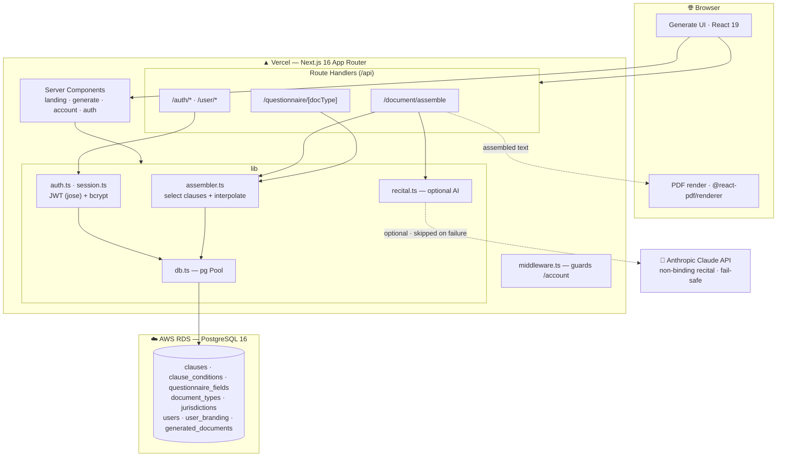
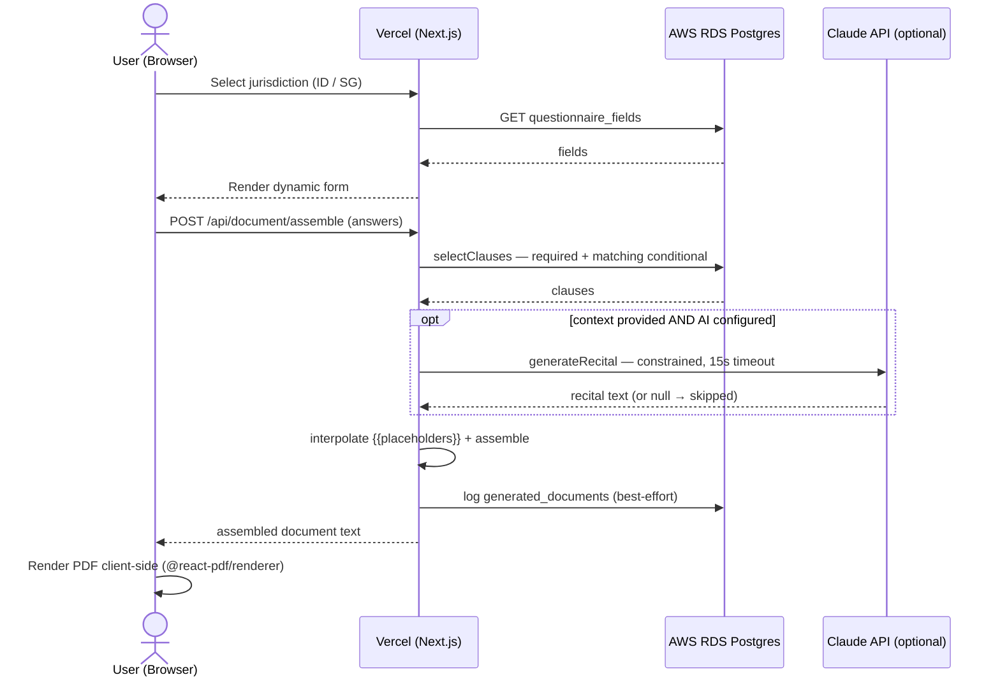

# LexSEA — Law-referenced legal documents for Indonesia & Singapore

> Your co-founder wants an NDA. Your lawyer charges SGD 600/hr.
> **LexSEA assembles complete, law-referenced legal documents — from a validated clause library, not a language model.** Ready to sign in under 5 minutes.

LexSEA is a self-serve legal-document platform covering **both** Indonesian and Singaporean law in one place — the way most Southeast Asian startups actually operate. Pick a document, answer plain-language questions, and download a clean, citation-backed PDF.

**Live demo:** https://lexsea.vercel.app
**Demo video:** _<add your YouTube link>_

---

## The problem

Early-stage founders in SEA constantly need basic legal documents (NDAs, employment contracts, service agreements). Their options today are bad:

- **Lawyers** — IDR 3–15 juta / SGD 350–1,200 per document, and days of turnaround.
- **Existing tools** — LegalZoom is US-only, Zegal is subscription + SG-only, KontrakHukum is human-assisted + ID-only. None cover **both** jurisdictions with consistent clauses.

## The solution

Three documents × two jurisdictions, generated in minutes:

| Document | Indonesia | Singapore |
|----------|-----------|-----------|
| **NDA** (mutual) | UU No. 30/2000 · BANI arbitration | Common law of confidence · SIAC |
| **Employment** (PKWT / fixed-term) | UU No. 13/2003 | Employment Act 1968 |
| **Service Agreement** | KUHPerdata | Singapore Contract Act |

Every clause **cites its legal basis** — no black box. Output is a print-ready A4 PDF with proper legal typography (materai block for ID, "for and on behalf of" signature blocks for SG, bilingual Bahasa/English where appropriate).

### Why this is not "ChatGPT for contracts"

The core design decision: **binding clauses are deterministically assembled from a validated clause library stored in PostgreSQL — never generated by an LLM.** Clause selection is driven by the user's answers via explicit conditions, then `{{placeholders}}` are interpolated. This keeps legal content auditable and reproducible.

AI (Anthropic Claude) is used for **exactly one optional, non-binding thing**: a short *background recital* describing why the parties are entering the agreement. It is heavily constrained ("use only the facts provided, invent nothing, no operative clauses, no statutes") and **fully fail-safe** — if the model is unavailable, slow, or refuses, the recital is silently skipped and the document still assembles. No AI output is ever treated as legally operative.

---

## Tech stack

- **Frontend / Backend:** Next.js 16 (App Router) + React 19, deployed on **Vercel**
- **Database:** PostgreSQL on **AWS RDS** (`pg` / node-postgres)
- **Auth:** JWT (`jose`) in an httpOnly cookie + `bcryptjs` (cost 12), constant-time login compare
- **PDF:** `@react-pdf/renderer` (client-side render)
- **AI (optional):** `@anthropic-ai/sdk` for the non-binding recital

### Architecture



### Document generation flow



---

## Getting started

### 1. Install

```bash
npm install
```

### 2. Environment

Create `.env.local`:

```bash
# Database (AWS RDS PostgreSQL)
PGHOST=your-db-host.rds.amazonaws.com
PGPORT=5432
PGUSER=postgres
PGPASSWORD=your-password
PGDATABASE=lexsea

# Auth — REQUIRED in production
JWT_SECRET=a-long-random-secret

# AI recital — optional (feature is skipped if unset)
ANTHROPIC_API_KEY=sk-ant-...
LEXSEA_AI_MODEL=claude-opus-4-8
```

### 3. Provision the database

```bash
npm run db:migrate                 # schema (clauses, questionnaire, …)
npm run db:seed                    # base clause + questionnaire content
npx tsx scripts/migrate-auth.ts    # users + user_branding tables
npx tsx scripts/enrich-clauses.ts  # finalized clause content
npm run db:verify                  # sanity check
```

### 4. Run

```bash
npm run dev    # http://localhost:3000
```

---

## Deployment (Vercel + AWS)

1. Provision an AWS RDS **PostgreSQL** instance (a `db.t4g.micro` Single-AZ is plenty for this workload).
2. Make it reachable from Vercel (publicly accessible + security-group rule on 5432).
3. Import the project into Vercel and set the env vars above (**`JWT_SECRET` is mandatory** — the app throws on boot in production without it).
4. Run the database provisioning steps against the RDS instance.

## Try the Pro plan

Sign up, go to **Account**, and redeem promo code **`HACKPRO2026`** to unlock custom letterhead / branding on generated PDFs.

---

## ⚠️ Disclaimer

LexSEA generates documents from a validated template library for informational purposes. **It is not legal advice and LexSEA is not a law firm.** Always review generated documents with a qualified lawyer before signing or enforcing them.
